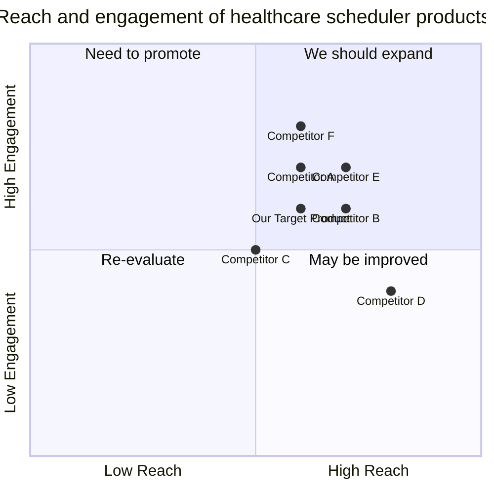

## Original Requirements:
The boss wants to create a command-line interface (CLI) chatbot healthcare scheduler for patients. Patients should be able to schedule, reschedule, and cancel appointments. The chatbot should also have a diary system to save the appointments.

## Product Goals:
- Create a user-friendly CLI chatbot healthcare scheduler.
- Provide a seamless experience for patients to schedule, reschedule, and cancel appointments.
- Implement a reliable diary system to save and manage appointments.

## User Stories:
- As a patient, I want to be able to schedule an appointment with the healthcare provider using the chatbot.
- As a patient, I want to be able to reschedule my appointment if necessary.
- As a patient, I want to be able to cancel my appointment if I cannot make it.
- As a patient, I want the chatbot to provide confirmation and reminders for my scheduled appointments.
- As a patient, I want to be able to view my scheduled appointments in the diary system.

## Competitive Analysis:
- Competitor A: Provides a web-based healthcare scheduler with appointment management features.
- Competitor B: Offers a mobile app for patients to schedule and manage healthcare appointments.
- Competitor C: Provides a voice-enabled virtual assistant for healthcare appointment scheduling.
- Competitor D: Offers an AI-powered chatbot for healthcare providers with appointment scheduling capabilities.
- Competitor E: Provides a comprehensive healthcare management platform with appointment scheduling features.
- Competitor F: Offers a user-friendly mobile app for patients to schedule and track healthcare appointments.

## Competitive Quadrant Chart:


## Requirement Analysis:
The product should be a command-line interface (CLI) chatbot healthcare scheduler for patients. It should allow patients to schedule, reschedule, and cancel appointments. The chatbot should also have a diary system to save and manage appointments. The product should provide a user-friendly experience and ensure reliability in appointment management.

## Requirement Pool:
```python
[
    ("Patients should be able to schedule appointments with healthcare providers.", "P0"),
    ("Patients should be able to reschedule appointments if necessary.", "P0"),
    ("Patients should be able to cancel appointments if they cannot make it.", "P0"),
    ("The chatbot should provide confirmation and reminders for scheduled appointments.", "P1"),
    ("The chatbot should have a diary system to save and manage appointments.", "P1")
]
```

## UI Design draft:
The CLI chatbot should have the following elements and functions:
- Main menu: Display options for scheduling, rescheduling, and canceling appointments.
- Appointment scheduling: Prompt the patient to enter the necessary details (e.g., date, time, healthcare provider) and confirm the appointment.
- Appointment rescheduling: Display the patient's scheduled appointments and allow them to select an appointment to reschedule. Prompt the patient to enter the new details and confirm the rescheduled appointment.
- Appointment cancellation: Display the patient's scheduled appointments and allow them to select an appointment to cancel. Confirm the cancellation.
- Diary system: Provide an option to view the patient's scheduled appointments in a diary format.
- Confirmation and reminders: Send confirmation messages and reminders to the patient for their scheduled appointments.

The UI design should have a clean and simple style with clear prompts and instructions. The layout should be intuitive and easy to navigate.

## Anything UNCLEAR:
There are no unclear points.