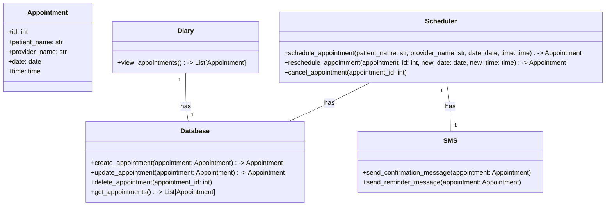
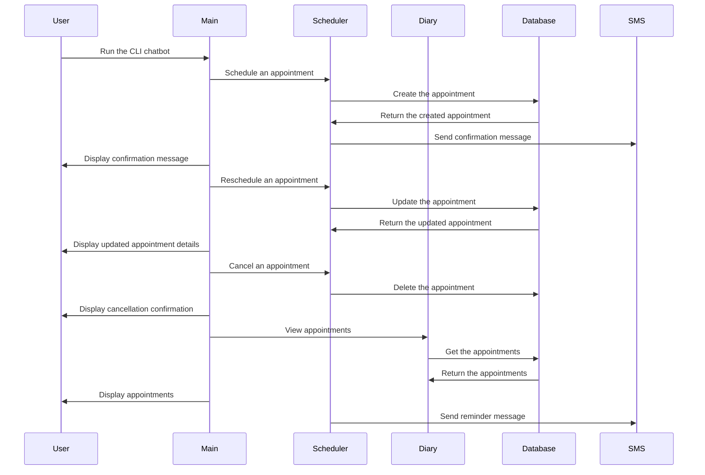

## Implementation approach:
For this CLI chatbot healthcare scheduler, we will use the following open-source tools:

1. Python: We will use Python as the programming language for the system development. Python is widely used, has a large community, and provides a rich set of libraries and frameworks.

2. Click: Click is a Python package for creating command-line interfaces. It provides a simple and intuitive way to define CLI commands, options, and arguments. We will use Click to implement the CLI functionality of the chatbot.

3. SQLite: SQLite is a lightweight, serverless database engine that stores data in a single file. We will use SQLite to store and manage the appointments in the diary system. SQLite is easy to use and does not require any additional setup or configuration.

4. Twilio: Twilio is a cloud communications platform that provides APIs for sending SMS messages and making phone calls. We will use Twilio to send confirmation messages and reminders to patients for their scheduled appointments.

## Python package name:
```python
"cli_healthcare_scheduler"
```

## File list:
```python
[
    "main.py",
    "scheduler.py",
    "diary.py",
    "database.py",
    "sms.py"
]
```

## Data structures and interface definitions:


## Program call flow:


## Anything UNCLEAR:
The requirements are clear and there are no unclear points.